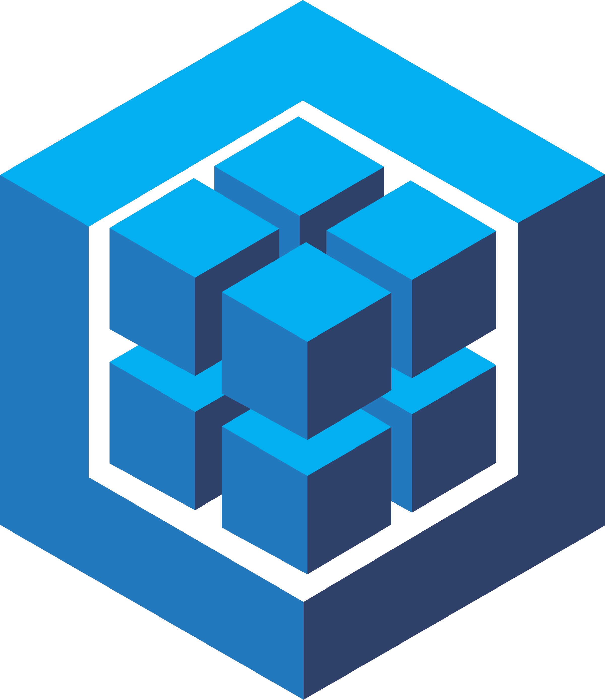
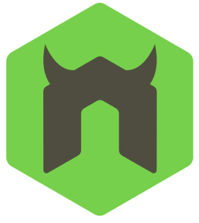

# ORMy Gosh E-commerce
Back-end operations for e-commerce platform utilizing Express.js API, Sequelize, and MySQL

     
 
 
 

## Description
This is a strictly back-end project that interacts with a MySQL database in order to view, update, and delete Product, Category, and Tag data for an e-commerce site.

## Table of Contents

- [Installation](#installation)
- [Usage](#usage)
- [Technology Stack](#technology-stack)
- [Credits](#credits)
- [License](#license)
- [Contact](#contact)

## Installation

This application does not have a UI so all interactions will take place in the command line and in Insomnia (or other desktop framework for testing RESTful applications). 
1. Clone the GitHub repository to your local environment using the provided SSH key.

        git clone git@github.com:SunnyOhK/ORMy-gosh-e-commerce.git

2. From your command line:
    - Insure that all node packages have been installed

          /ORMy-gosh-e-commerce
              npm i
    - Connect with the MySQL shell from the db folder and source the schema file
    
          /ORMy-gosh-e-commerce/db
              mySQL -u <username> -p
              (on prompt)  <input password> 
              source schema.sql;
            
    - Initiate the seeds JavaScript file and start the server from the root folder

          /ORMy-gosh-e-commerce
              node seeds/index.js  <--OR-->  npm run seed
              
              node server.js  <--OR-->  npm run watch

3. In your Insomnia dashboard, you can test all GET, POST, PUT, and DEL routes using the following URL and the following subdirectories:

|  | URL Paths |  |
| ---- | --- | --- |
| . . . . . . . . . . . . | http://localhost:3001/api | . . . . . . . . . . . . |
| CATEGORIES | PRODUCTS | TAGS |
| /categories | /products | /tags |
| /categories/:id | /products/:id | /tags/:id |

The demo video (below) will take you step-by-step through the POST and PUT data input syntax if you require additional instruction. 

## Usage 

After you clone the repository and install the node modules, please follow this video tutorial for simple step-by-step instructions:

### Demo:

https://github.com/SunnyOhK/ORMy-gosh-e-commerce/assets/127900916/9b46e238-22d1-4b4a-90ca-4aed19c0b8b3

🎬 Or you can view the video at: [https://](https://watch.screencastify.com/v/hI8H5B09gjYRy6FGwkxe)

## Technology Stack

|  | Tech Stack | Description |
| ---- | --- | --- |
| Foundation |  |  |
|  | JavaScript | Scripting language for webpages |
|  | MySQL | Open Source SQL database management system |
| Testing |  |  |
|  | Insomnia REST | Collaborative open source API development platform |
| npm Packages |  |  |
|  | Node.js | Javascript Framework |
|  | Sequelize | TypeScript and Node.js ORM |
|  | Nodemon | Utility to monitor code changes and restart server |
|  | Dotenv | Secrets management toolkit |
|  | Express | Node.js module |

## Credits

- Alex Gonzalez: EdX Tutor - I was getting confused about testing the PUT and GET requests so Alex walked me through the router concepts using a through-path (ProductTags.js). After his explanations, I was able to return the necessary category, product, and tag data while reducing the redundance often created by the ProductTags model.

## License
This project is licensed under: [MIT](https://choosealicense.com/licenses/mit/)
 

## Contact

For questions, please contact me:

### GitHub: 
  &nbsp;&nbsp;&nbsp; [SunnyOhK](https://github.com/SunnyOhK)
### Project Link: 
  &nbsp;&nbsp;&nbsp; https://github.com/SunnyOhK/ORMy-gosh-e-commerce
### Email: 
  &nbsp;&nbsp;&nbsp; 127900916+SunnyOhK@users.noreply.github.com
